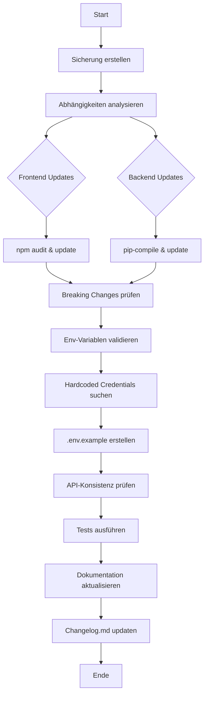

# Update-Plan: Backend & Frontend Aktualisierung

## Übersicht

Dieser Plan beschreibt die vollständige Aktualisierung der Password-Vault-Anwendung, einschließlich Sicherung, Abhängigkeits-Updates, Sicherheitsüberprüfung und Dokumentation.

## Workflow-Diagramm



## Detaillierte Schritte

### 1. Sicherung erstellen [backup/]

Zu sichernde Dateien:
- `.env` → `backup/.env.backup`
- `package.json` → `backup/package.json.backup`
- `requirements.txt` → `backup/requirements.txt.backup`
- `docker-compose.yml` → `backup/docker-compose.yml.backup`

### 2. Abhängigkeiten analysieren

#### Frontend (npm)
| Paket | Aktuell | Empfohlen | Risiko |
|-------|---------|------------|--------|
| react | ^18.2.0 | ^18.3.1 | Niedrig |
| react-router-dom | ^6.20.0 | ^6.22.0 | Mittel |
| axios | ^1.6.2 | ^1.7.0 | Niedrig |
| lucide-react | ^0.294.0 | ^0.400.0 | Mittel |
| react-scripts | 5.0.1 | CRITICAL | **Hoch** |

#### Backend (Python)
| Paket | Aktuell | Empfohlen | Risiko |
|-------|---------|------------|--------|
| Flask | 3.0.0 | 3.0.3 | Niedrig |
| SQLAlchemy | 2.0.23 | 2.0.25 | Niedrig |
| cryptography | 41.0.7 | 43.0.0 | **Mittel** |
| PyJWT | 2.8.0 | 2.9.0 | Niedrig |
| zxcvbn | >=4.4.25 | 4.4.2 | Niedrig |

### 3. Frontend Updates

```bash
# Backup erstellen
cp frontend/package.json backup/

# Sicherheitsaudit
cd frontend && npm audit

# Kritische Sicherheitsupdates
npm update --save

# Major-Updates mit Breaking Changes prüfen
npm outdated
```

**Erwartete Breaking Changes:**
- `react-router-dom`: `useNavigate` Hook-Syntax bleibt gleich
- `axios`: Response-Struktur bleibt gleich
- `lucide-react`: Icon-Namen könnten sich ändern

### 4. Backend Updates

```bash
# Backup erstellen
cp backend/requirements.txt backup/

# pip-compile für lock-Datei nutzen
pip-compile requirements.in

# Updates anwenden
pip install --upgrade -r requirements.txt
```

**Erwartete Breaking Changes:**
- `cryptography 43.x`: Einige deprecated APIs entfernt
- `SQLAlchemy 2.x`: Query-Syntax bleibt stabil

### 5. Umgebungsvariablen prüfen

#### Aktuell definierte Variablen [.env](.env):
```bash
SECRET_KEY=change-this-to-a-secure-random-string-in-production
FLASK_ENV=development
JWT_SECRET_KEY=change-this-to-a-secure-jwt-secret-in-production
JWT_ACCESS_TOKEN_EXPIRES_HOURS=1
JWT_REFRESH_TOKEN_EXPIRES_DAYS=7
ENCRYPTION_KEY=change-this-to-a-secure-encryption-key
DATABASE_PATH=/app/data/vault.db
SESSION_TIMEOUT_MINUTES=30
ALLOWED_ORIGINS=http://localhost:3000
LOG_LEVEL=INFO
```

#### Fehlende Variablen für Frontend:
```bash
REACT_APP_API_URL=http://localhost:5000/api/v1
REACT_APP_APP_NAME=Password Vault
```

### 6. Sicherheitsprüfungen

#### Zu prüfende Dateien auf hardcoded credentials:
- [ ] `backend/app.py`
- [ ] `frontend/src/services/api.js`
- [ ] `frontend/src/components/*.js`
- [ ] `docker-compose.yml`

### 7. .env.example erstellen

Neue [.env.example](.env.example):
```bash
# ====================================
# Password Vault - Environment Template
# ====================================

# Flask Configuration
SECRET_KEY=your-secure-random-string-min-32-chars
FLASK_ENV=development|staging|production

# JWT Configuration
JWT_SECRET_KEY=your-jwt-secret-key
JWT_ACCESS_TOKEN_EXPIRES_HOURS=1
JWT_REFRESH_TOKEN_EXPIRES_DAYS=7

# Encryption Configuration
ENCRYPTION_KEY=your-encryption-key-32-chars-base64

# Database Configuration
DATABASE_PATH=/app/data/vault.db

# Session Configuration
SESSION_TIMEOUT_MINUTES=30

# CORS Configuration
ALLOWED_ORIGINS=http://localhost:3000,https://yourdomain.com

# Logging
LOG_LEVEL=DEBUG|INFO|WARNING|ERROR

# Frontend Configuration
REACT_APP_API_URL=http://localhost:5000/api/v1
```

### 8. API-Endpunkte prüfen

| Route | Methode | Auth | Env-Vars |
|-------|---------|------|----------|
| `/health` | GET | Nein | - |
| `/api/v1/auth/register` | POST | Nein | - |
| `/api/v1/auth/login` | POST | Nein | - |
| `/api/v1/auth/logout` | POST | JWT | JWT_SECRET_KEY |
| `/api/v1/auth/profile` | GET/PUT | JWT | JWT_SECRET_KEY |
| `/api/v1/passwords` | GET/POST | JWT | ENCRYPTION_KEY |
| `/api/v1/passwords/:id` | GET/PUT/DELETE | JWT | ENCRYPTION_KEY |

### 9. Testplan

```bash
# Backend Tests
cd backend && pytest -v

# Frontend Tests
cd frontend && npm test -- --watchAll=false

# E2E Tests (optional)
npm run test:e2e
```

### 10. Dokumentation

- [ ] CHANGELOG.md aktualisieren
- [ ] README.md bei Bedarf ergänzen
- [ ] Migration-Guide bei Breaking Changes

## Zeitplan

1. **Sicherung & Analyse**: 15 Min
2. **Frontend Updates**: 30 Min
3. **Backend Updates**: 30 Min
4. **Sicherheitsprüfung**: 20 Min
5. **Env-Variablen & .env.example**: 15 Min
6. **Testing**: 45 Min
7. **Dokumentation**: 15 Min

**Gesamt**: ~2.5 Stunden
